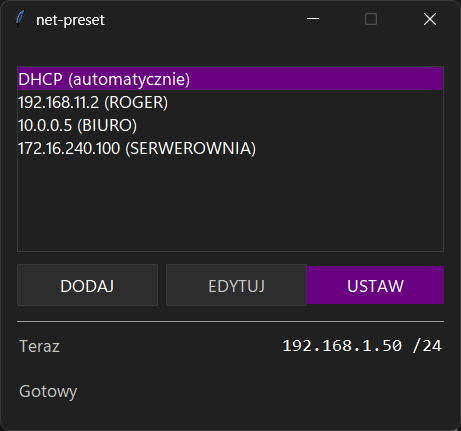

# net-preset

[](LICENSE)

Named IPv4 profiles for a Windows Ethernet card, applied in one click.

Switching a laptop between a service subnet and DHCP means five levels of Windows network
settings, an address typed from memory, and the same walk back afterwards. Done a dozen
times a day on site, it is slow and it invites a typo in the one field where a typo costs
a second visit.

net-preset stores the addresses once and applies them from a list.



The window follows Windows 11's dark style, including the title bar and your own accent
colour. It is drawn entirely with the standard library — there is no theming package, and
no runtime dependency of any kind.

## Requirements

- Windows 11 x64. Windows 10 should work; the dark title bar needs build 18362 or later
  and the matching window border is Windows 11 only, both degrading silently to light
  chrome. Not tested there.
- One physical Ethernet card. More than one is fine — a picker appears.
- Administrator rights. Changing IPv4 configuration requires them, and that is the whole
  point of the program, so it asks once at launch rather than at every click.
- **Python 3.14 or later**, if you run from source. Not 3.13: three modules use PEP 758
  `except` syntax, so an older interpreter fails with a `SyntaxError` at import rather than
  a readable message about the version.

## Install

### For an operator

Two artifacts, one build. They carry the same program and differ only in how it gets onto
the machine.

**`net-preset-setup.exe` — for a machine the technician keeps.** Installs into
`C:\Program Files\net-preset` for every account on the machine, with a Start Menu entry, an
optional desktop shortcut and an entry under Apps & features that takes it away again. It
asks for administrator rights once, to write there.

Per-machine is deliberate, and it is the opposite of what the sibling project card-wedge
chose. net-preset cannot change an address without an administrator token and its manifest
says so, which means a UAC prompt at every launch whatever the installer did. Installing
per-user would save the operator nothing and would put one copy in each account.

**`net-preset.exe` — for a USB stick, or a machine touched once.** A single file. Put it
anywhere and run it. Deleting it uninstalls the program; the only thing left behind is the
settings file described under [Where the settings live](#where-the-settings-live). Nothing
is written to Program Files and nothing appears in Apps & features.

Either way Windows shows a UAC prompt before the window appears. That is the manifest asking
for the administrator token the program needs to change an address.

#### If Windows refuses to run it

> Zasady kontroli aplikacji zablokowały ten plik

That is **Smart App Control**, on by default on clean Windows 11 installations. Neither
artifact is code-signed.

What was measured on the development machine, with Smart App Control enforced, from an
unchanged build script:

| Attempt | Result |
|---|---|
| One build of `net-preset.exe` | **blocked** at process creation (`winerror 4551`) |
| A later build, same spec, same script | ran, and stopped at the elevation prompt as intended |
| `pyinstaller.exe`, the unsigned launcher inside the virtual environment | blocked once mid-build, ran fine the next day |
| `net-preset-setup.exe`, first build | ran, elevated, and installed correctly |

Smart App Control judges each unsigned binary on its own and its verdict is not stable
across builds. Rebuilding is a re-roll, not a workaround. The sibling project card-wedge
measured the same instability in the opposite direction — a build that ran, then the same
artifact blocked after a rebuild — so do not read either result as a rule.

The installer's row is one observation, not a pattern, and it is the row least safe to lean
on. An unsigned setup executable is the shape Smart App Control scrutinises hardest, and
card-wedge — same machine, equally unsigned — had an installer refused while the application
beside it was admitted. That one build of `net-preset-setup.exe` was let through says
nothing about the next one. If a machine turns the installer away, reach for the bare
executable rather than rebuilding, and for the source if it turns that away too.

**The fix is code signing.** Until then, run from source: `uv run net-preset` goes through
a signed Python interpreter, which Smart App Control does not treat this way.

Smart App Control has no per-application allowance, and turning it off cannot be undone
without reinstalling Windows.

### For development

With [uv](https://docs.astral.sh/uv/) installed:

```powershell
uv sync
uv run net-preset
```

Run from source there is no manifest, so the program checks its own token and relaunches
itself elevated through `ShellExecuteW`. Cancelling that prompt does not close it: the
window opens with `USTAW` greyed out and the status line reading
`Brak uprawnień administratora — USTAW nie zadziała`, so you can still see and edit
profiles.

## Use

The list holds `DHCP (automatycznie)` first, then every saved profile as its address
followed by its name:

```
DHCP (automatycznie)
192.168.11.2 (ROGER)
10.0.0.5 (BIURO)
```

DHCP is not a profile. It cannot be edited or deleted and it is always the first row, so
the way back to a working network is in the same place whatever else the list holds.

| Button | What it does |
|---|---|
| `DODAJ` | Opens an empty form. The mask starts at `255.255.255.0`. |
| `EDYTUJ` | Opens the selected profile. Disabled on the DHCP row. `USUŃ` sits in the bottom-left of that window and asks before removing anything. |
| `USTAW` | Applies the selected row to the card. Double-clicking a row, or pressing Enter, does the same. |

A profile needs a name, an address and a mask. The gateway, the primary DNS and the
alternate DNS may all be left empty — an empty gateway means the card gets no default
route, which is the normal case on an isolated controller subnet. An alternate DNS with no
primary is refused; there is no index 2 without an index 1.

The `Teraz` line shows what the card is actually carrying, refreshed every two seconds,
independently of anything you have pressed.

### What USTAW checks

Applying is not the same as succeeding, and `netsh` will exit 0 on a command it did not
understand. So after the commands run, net-preset reads the card back through the IP helper
API and compares it against what was asked for — the address and prefix, the gateway, the
DNS servers in the order they were written, and, when the cable is in, that the card has
actually stopped being a DHCP client. The status line reports the comparison, not the
commands:

| Line | Meaning |
|---|---|
| `Ustawiono 192.168.11.2 /24` | The card carries the profile. |
| `Ustawiono 192.168.11.2 /24 — czekam na kabel` | Stored and complete; the last step waits on a link. See below. |
| `DHCP: 192.168.1.50 /24` | A lease arrived. |
| `DHCP włączone — czekam na kabel` | DHCP is on; no lease until something is plugged in. |
| `Karta ma 10.0.0.9 /24, nie 192.168.11.2 /24` | The card took something else. |
| `Adres ustawiony, ale karta nadal jest klientem DHCP` | Cable in, address on, but the switch did not finish. |

If a command is refused part-way through, the line says so and says whether the address had
already changed. **Applying the same profile twice is safe** — that is also how you clean up
after an interrupted apply.

## Configuring with the cable out

You can set a profile up at your desk with nothing plugged in, carry the machine to site,
and plug it in there.

Pressing `USTAW` with no cable writes the address, the mask, the gateway and both DNS
servers to the card straight away. All of it. The one step Windows holds back is finishing
the switch out of DHCP — it waits for a link. So while the cable is out, the card carries
your static address *alongside* a `169.254.x.x` self-assigned one, and everything still
calls it a DHCP client: `ipconfig` and `netsh` report `DHCP enabled: Yes`, and the registry
has `EnableDHCP = 1`. That is normal, and it is not a fault.

net-preset says so rather than pretending otherwise:

> `Ustawiono 192.168.11.2 /24 — czekam na kabel`

in ordinary grey, not red, because it is a success. Nothing else is needed.

Plug the cable in and Windows finishes on its own: the DHCP flag clears and the `169.254`
address goes. This was measured rather than assumed — on the test card the flag was still
set with the cable out and clear fifteen minutes later with the cable in, nothing having
run in between. Plug in first and press `USTAW` afterwards and it all lands at once, with
the plain `Ustawiono …` and no mention of a cable.

Three things worth knowing:

- **The status line does not update itself.** Not this message and not any other: it
  records what was true when it was written, and nothing re-checks it. So it goes on saying
  `— czekam na kabel` after you plug in. The `Teraz` line above it does refresh, but it
  renders an address and never the DHCP flag, so it looks the same before and after the
  cable — it will not tell you the switch finished. Pressing `USTAW` on the same profile
  once the cable is in is the only thing that re-reports the flag, and it is safe to do.
- **Do not read `DHCP enabled: Yes` with the cable out as a failure.** It is the deferred
  step and it clears itself.
- While that flag is still set, nothing stops a DHCP server on the site network from
  answering before Windows commits the switch. This has not been seen happening and the
  program does not claim it cannot. If it did, the `Teraz` line would show the leased
  address within a couple of seconds.

## Where the settings live

```
%LOCALAPPDATA%\net-preset\profiles.json
%LOCALAPPDATA%\net-preset\settings.json
```

`profiles.json` holds the list; `settings.json` remembers which card you picked, by the
adapter's GUID rather than its name, so renaming the connection does not lose the choice.

**That path is resolved while the program is elevated,** which is worth saying plainly. On
an ordinary machine with one account it makes no difference: the account that answers the
UAC prompt is the account already signed in, and `%LOCALAPPDATA%` means the same folder
either way. Where it does make a difference is a standard user whose UAC prompt is approved
with a *different* administrator account — over the shoulder, or with the technician's own
credentials. The program then runs as that administrator and reads and writes that
administrator's `%LOCALAPPDATA%`, so profiles saved in one context are invisible in the
other and the machine appears to hold two separate lists. This is a property of the program,
not of how it was put on the machine: the installer does not cause it and the bare
executable does not avoid it.

Both are written to a temporary file and moved into place, so an interrupted write cannot
leave a half-file behind. A missing, unreadable or corrupt file costs the profiles, never
the program: it opens with an empty list and says what happened. A single malformed entry
is dropped and the rest are kept.

## Building

```powershell
.\build.ps1
```

Checks that `uv` is present, syncs, runs `ruff` and the test suite, and only then packages
a one-file executable into `dist\`. Any check failing stops the build with that tool's exit
code — a build script that packages a red test suite is worse than no build script.

The manifest is verified after packaging: the build fails if `requireAdministrator` did not
make it into the executable.

`dist\net-preset-setup.exe` is compiled last, from `packaging\net-preset.iss`, and needs
[Inno Setup](https://jrsoftware.org/isinfo.php): `winget install --id JRSoftware.InnoSetup`.
Without it the build stops at that step and says which command fixes it — the executable is
finished by then, so a missing Inno Setup costs the installer, not the build. There is no
switch to skip the step.

The installer packages the executable that was just built. There is no second PyInstaller
run and no separate portable archive, because the executable already is the portable form.
Its version is read back out of the compiled installer afterwards and compared against
`pyproject.toml`, because the `.iss` has to name the version a second time and nothing else
would notice the two drifting apart.

## Known limits

- **IPv4 only.** No IPv6, no WINS, no Wi-Fi profiles, no import or export.
- **Virtual adapters may appear in the picker.** Cards are matched on interface type and
  the NDIS physical medium recorded in the registry, which is what separates a real
  Ethernet card from a Bluetooth PAN adapter — both report themselves as `802.3`. A card
  the registry says nothing about is kept rather than hidden, on the grounds that an
  unknown driver should not make a card invisible that Windows shows. On a machine running
  Hyper-V, VMware, VirtualBox or TAP-Windows, their adapters may therefore be listed. Not
  measured; there was no such machine to hand.
- **The verification cannot see what it did not ask for.** A gateway or DNS server put
  there by something else is not reported.

## How it works

Reads go through `GetAdaptersAddresses` in `iphlpapi`, bound with `ctypes`. One call
returns the friendly name, the GUID, the interface type, the link state, the addresses with
their prefix lengths, the gateways, the DNS servers and the DHCP flag, without starting a
process — which is what lets the `Teraz` line refresh on a timer without stuttering.

Writes go through `netsh`, one invocation per operation, arguments passed as a list and
never through a shell, so a connection name containing spaces or Polish characters
survives. `netsh` answers in the system language, and its output is decoded as UTF-8 first
and the OEM code page second — measured, in that order: real `netsh` writes UTF-8 into a
pipe regardless of the console code page.

Applying runs on a worker thread; the window is only ever handed the result.

## Development

```powershell
uv run pytest
uv run ruff check .
uv run ruff format .
```

The tests run without a network card: every call that touches the operating system sits
behind an injected callable, and the pure modules — the profile model, the command builder,
the two stores — carry most of the suite.

What that cannot cover is `netsh` itself, so the write path is exercised end to end by two
scripts kept outside the repository, one with a cable and one without. Both capture the
card's state first, verify every result against the registry and `Get-NetIPAddress` rather
than against the program's own answer, and restore DHCP from a `finally` block.

## License

MIT. See [LICENSE](LICENSE).
